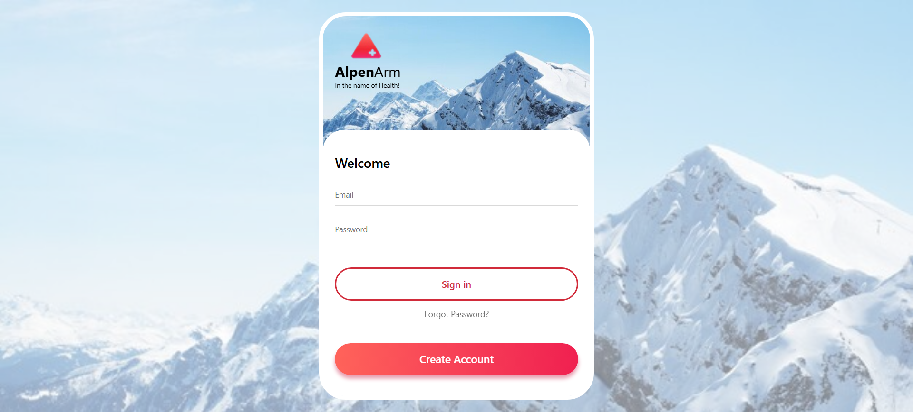

# 🔑 Sign In Page

A simple and modern Sign In form built with HTML and CSS.

This project demonstrates a clean and responsive login page layout with smooth styling.

---

## ✨ Features

- Pure HTML & CSS (no JavaScript)
- Responsive design for desktop and mobile
- Clean and minimal UI
- Input focus effects and hover transitions

---

## 💡 What I Learned

While building this project, I practiced:

- Structuring login forms with semantic HTML
- Styling input fields and buttons with CSS
- Creating responsive layouts using Flexbox and media queries
- Using hover and focus pseudo-classes for better user experience

---

## 📸 Screenshots

**Desktop View**

---

## 🚀 Live Demo

[🔗 View on GitHub Pages](https://amirhosseinjamalian.github.io/html-css-practices/mini-projects/Login_page_1/)

---

🧠 A compact project to practice building responsive login forms with modern design.
