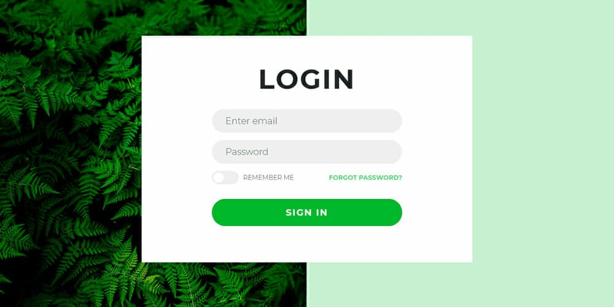

# 🔑 Login Form

A simple and modern Login Form built with HTML and CSS.

This project showcases a clean and responsive login page layout with smooth design and balanced color contrast.

---

## ✨ Features

Pure HTML & CSS (no JavaScript)

Responsive design for desktop and mobile

Clean and minimal user interface

Input focus effects and hover transitions

---

## 💡 What I Learned

- While building this project, I practiced:

- Structuring login forms using semantic HTML

- Styling input fields and buttons with CSS

- Creating responsive layouts with Flexbox and media queries

- Using hover and focus pseudo-classes for better user experience

---

## 📸 Screenshots
**Desktop View**

---

## 🚀 Live Demo

[🔗 View on GitHub Pages](https://amirhosseinjamalian.github.io/html-css-practices/mini-projects/Login_page_2/)

---

🧠 A compact project to practice creating responsive login forms with a modern and minimal design.
